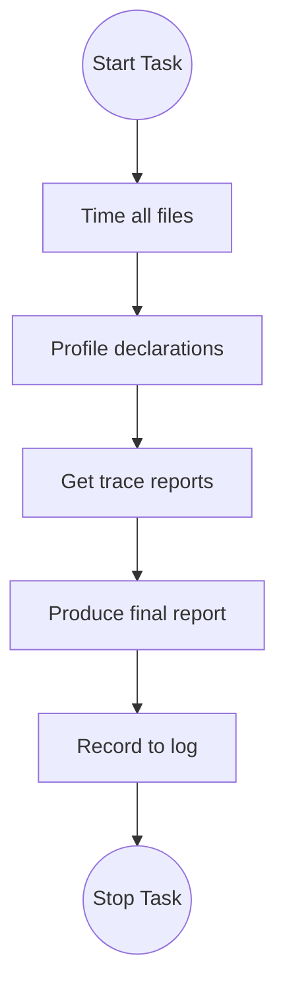

# Speed diagnosis

You will investigate and diagnose issues with compilation time in certain files in FLT.

## Boss theorems

The boss theorems of this task are leaf-node theorems that must be invariant under your work.
By invariant, I mean that they should always compile and that their axiom list should always consist precisely of
`[propext, Classical.choice, Quot.sound]`.

Specifically, these are the following theorems:
- `NumberField.AdeleRing.cocompact`
- `NumberField.AdeleRing.discrete`

## Task

Your overall task is to diagnose issues with compilation time in a sub-tree of the FLT project.
The files in consideration are detailed in `.cache/flt_import_closure.txt` and
`.cache/flt_import_closure_output.json`.

You MUST follow the process outlined in the following flowchart.
Before every action you MUST state which phase of the flowchart you are in using,
for example, `[CURRENT STATE: TIME]`.

### 📋 Process State Definitions

| State | Definition & Action | Success Criteria (Gate) |
| :--- | :--- | :--- |
| **TIME** | Run the `flt_profile_ranking` tool to get file-level compilation times. | A ranked list of the most expensive files with respect to compilation time. |
| **PROFILE** | For each of the top offending files call the `profile_file` tool to get per-decl compilation statisticts. | A ranked list of the most expensive decls in each of the most expensive files as output by the previous step |
| **TRACE** | Use the `analyze_synth_trace` tool and the `analyze_isdefeq_trace` tool on the list of declarations output by the previous step. | Trace outputs and individual reports for each of the top declarations. |
| **REPORT** | Create a single global report containing common issues across the trace reports; provide recommendations for a future agent to fix. | Singular report containing description of the key issues and recommendations; it should be detailed enough for a future agent to action your recommendations. |
| **LOG** | Use the `record_log` tool to record your actions and findings in `.cache/log.jsonl` | -- |
| **STOP** | -- | -- |

- **CRITICAL**: The number of top files/decls to focus on is 5.
- **CRITICAL**: Your final report should try to identify commonalities amongst the issues found in the top 25 final declarations.
- **CRITICAL**: Your final report should also identify potential conflicts amongst the issues found in the top 25 final declarations. For example, if one proposed fix could cause degradation in other areas then this must be flagged.
- **CRITICAL**: Your final report should provide a priority ordering of the proposed fixes. This should take into account their overall ranking in the compilation time, but also the likelihood that it may cause conflicts for other areas to fix.
