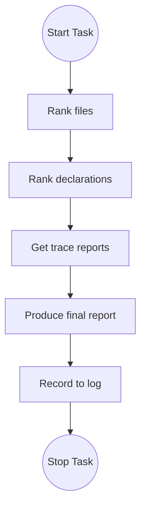
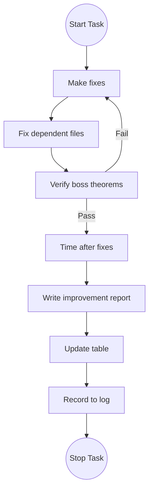

# Speed diagnosis

You will investigate and diagnose issues with compilation time in certain files in FLT.

## Boss theorems

The boss theorems of this task are leaf-node theorems that must be invariant under your work.
By invariant, I mean that they should always compile and that their axiom list should always consist precisely of
`[propext, Classical.choice, Quot.sound]`.

Specifically, these are the following theorems:
- `NumberField.AdeleRing.cocompact`
- `NumberField.AdeleRing.discrete`

## Task: speed diagnosis

Your task is to diagnose issues with compilation time in a sub-tree of the FLT project.
The files in consideration are detailed in `.cache/flt_import_closure.txt` and
`.cache/flt_import_closure_output.json`.

You MUST follow the process outlined in the following flowchart.
Before every action you MUST state which phase of the flowchart you are in using,
for example, `[CURRENT STATE: RANK_FILE]`.

### 📋 Process State Definitions

| State | Definition & Action | Success Criteria (Gate) |
| :--- | :--- | :--- |
| **RANK_FILE** | Rank all files by heartbeats via `flt_heartbeat_ranking mode=before`, which reads the static file table (`.cache/metrics_files.json`) and writes the `before` snapshot to the pass dir. This re-derives the ranking (a sort) from cached values — it does NOT recompute heartbeats; a file already in the table is a zero-compile read, and only a file absent from the table is measured on demand. **Precondition:** the static tables are bootstrapped and current (the previous round's `UPDATE` committed any changes). | A ranked list of the most expensive files by heartbeats. |
| **RANK_DECL** | For each of the top offending files, read its ranked declarations from the static decl table (`.cache/metrics_decls.json`, `by_module[<file>].decls`). Zero-compile read. | A ranked list of the most expensive decls in each of the top files. |
| **TRACE** | Use the `analyze_synth_trace` tool and the `analyze_isdefeq_trace` tool on the list of declarations output by the previous step. | Trace outputs and individual reports for each of the top declarations. |
| **REPORT** | Create a single global report containing common issues across the trace reports; provide recommendations for a future agent to fix. | Singular report containing description of the key issues and recommendations; it should be detailed enough for a future agent to action your recommendations. |
| **LOG** | Use the `record_log` tool to record your actions and findings in `.cache/log.jsonl` | -- |
| **STOP** | -- | -- |

- **CRITICAL**: The number of top files/decls to focus on is 5.
- **CRITICAL**: The `before` snapshot (from `flt_heartbeat_ranking mode=before`) is saved to the "before" subdirectory of the pass in .cache.
- **CRITICAL**: Your final report should try to identify commonalities amongst the issues found in the top 25 final declarations.
- **CRITICAL**: Your final report should also identify potential conflicts amongst the issues found in the top 25 final declarations. For example, if one proposed fix could cause degradation in other areas then this must be flagged.
- **CRITICAL**: Your final report should provide a priority ordering of the proposed fixes. This should take into account their overall ranking in the compilation time, but also the likelihood that it may cause conflicts for other areas to fix.

## Task: speed fixing

Your task here is to make fixes as recommended by the latest speed diagnosis.

You MUST follow the process outlined in the following flowchart.
Before every action you MUST state which phase of the flowchart you are in using,
for example, `[CURRENT STATE: FIX]`.

### 📋 Process State Definitions

| State | Definition & Action | Success Criteria (Gate) |
| :--- | :--- | :--- |
| **FIX** | Make the fixes recommended by the diagnosis. Follow the priority ordering. Use `lean-lsp-mcp` tools to interact with the Lean environment | Isolated files compile without errors. |
| **FIX_DEPENDENT** | Continue fixing dependent modules until the 64 modules compile without errors. | All targeted files compile without error. |
| **CHECK_BOSS** | Verify that the boss theorems still compile and that they are axiom-clean. | If axiom-clean then move on to TIME_FIX, else return to FIX to resolve the issue |
| **TIME_FIX** | Validate every fix two ways. (1) **Deterministic mechanism gate (primary):** re-run `capture_isdefeq_trace`/`capture_synth_trace` (or `analyze_*`) on each fixed decl and confirm the diagnosed pathology is gone (e.g. culprit instance no longer applied, redundancy/isDefEq node-count dropped). This is load-invariant. Do NOT gate on `profile_file` heartbeats — they count elaborator steps, not the isDefEq/synth cost that dominates these decls, and can move opposite to wall time. (2) **Quantify the payoff — prefer instructions over wall time.** On Linux/CI use `flt_instruction_count` (`perf stat -e instructions:u`), the deterministic, load-invariant metric Mathlib's radar uses: retired instructions vary <1% run-to-run, so an "after" number is directly comparable to "before" **even across sessions**. This is the preferred quantifier. `perf` is Linux-only, so on macOS the tool is unavailable — there, fall back to **paired same-session wall time**: measure `flt_profile_ranking` (`runs`≥5) on the **modified** file and the **reverted** file **back-to-back in the same session** and report the *delta* (never a cross-session before/after — machine load drifts ±20–30% between sessions and makes those deltas meaningless). Finally run `flt_build_timing clean=true` for a rough overall-build overview. You do not need to time files fixed only as dependents. | Each fix's pathology confirmed removed by the deterministic trace, AND a paired same-session wall-time delta recorded per fixed file. |
| **REPORT** | Create a single report comparing the timings after fixes and before. Report paired same-session wall-time deltas (modified vs reverted) and the deterministic trace evidence per fix; explicitly flag any measurement that stayed within noise. | -- |
| **UPDATE** | Commit the new heartbeats for the changed files to the static tables via `flt_heartbeat_ranking mode=after`. One call recompiles only the changed files plus their direct dependents, updates just those rows in `.cache/metrics_files.json` / `.cache/metrics_decls.json`, and writes the `after` snapshot to the pass dir. This is the single point at which the static tables change. Note: this heartbeat remeasure is separate from `TIME_FIX`'s wall-time/instruction payoff timing. | Only the changed rows are updated; static tables current for the next diagnosis. |
| **LOG** | Use the `record_log` tool to record your actions and findings in `.cache/log.jsonl` | -- |
| **STOP** | -- | -- |

- **CRITICAL**: When calling timing tools make sure they are saved to an "after" subdirectory of the pass in .cache.
- **CRITICAL**: Do not make any fixes that are flagged by the diagnosis for mathlib.
- **CRITICAL**: Avoid making changes that improve one area at the cost of another, as flagged by the diagnosis.
- **CRITICAL**: Wall-clock timings are noisy and machine-load-dependent. Validate fixes with the deterministic trace as the correctness gate; quantify payoff with `flt_instruction_count` (deterministic instructions, Linux/CI) where available, and otherwise only trust wall-time deltas measured **paired, same-session** (modified vs reverted, `runs`≥5). Never conclude "improvement" or "regression" from a single reading or a cross-session before/after wall comparison.
